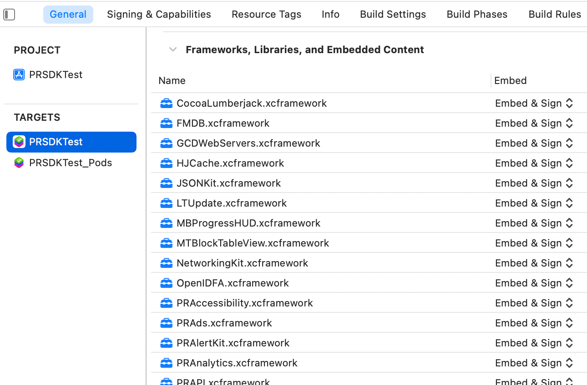

### PressReader iOS SDK -- Readme

# Distribution

The latest PressReader SDK can be downloaded from [release page](https://github.com/pressreader/pr-ios-sdk/releases). For receiving the SDK release notifications, subscribe to Watch → Custom → Releases event.
Additionally, you may want to review the ["PressReader SDK - release policies"](https://pressreader.atlassian.net/wiki/x/GAA70w).

> __The PressReader iOS SDK__ (referred to as __PRSDK__) comprises a collection of _PressReader iOS frameworks_ along with third-party dependencies.

## Installation using CocoaPods

For seamless integration of the latest version of our SDK via _CocoaPods_, utilise the __PRSDK__ pod. 
Below is an example of a typical _podfile_ configuration.

```ruby
# Podfile

ios_version = '17.0'
platform :ios, ios_version

use_frameworks!

target 'HOST_APP_TARGET_NAME' do
  pod 'PRSDK'
end

post_install do |installer|
  installer.pods_project.targets.each do |target|
    target.build_configurations.each do |config|
      config.build_settings['IPHONEOS_DEPLOYMENT_TARGET'] = ios_version
    end
  end
end
```

## Manual Installation

Ensure to link and embed all xc-frameworks found within the **`PRSDK/`** directory within your host application.
Should your application already utilise certain dependencies listed, avoid redundant linking of those frameworks.



Within the `PRSDK/` directory, you'll find _`PressReaderResources.bundle`_. Ensure not to link it alongside other frameworks. Instead, include it in the **Copy Bundle Resources** build phase of your host application.


# Usage

You operate `PRSDK` using _`PressReader`_ singleton class (shared instance).

Import the `PRUI` module into your environment to gain access.

```Swift
import PRUI
```

Begin by accessing the shared instance as follows.If you require **launch options** (such as an analytics tracker), set them before accessing the shared instance for the first time.

```Swift
PressReader.launchOptions = launchOptions
PressReader.instance()
```

 If your application relies on PressReader UI, you can access it through  the `rootViewController` property of the shared instance. Present it within your view controller using the following code:

```Swift
let PRUI = PressReader.instance().rootViewController
YOUR_VIEW_CONTROLER.present(PRUI, animated: true, completion: nil)
```

When you no longer need the shared instance, you can deallocate resources it uses by calling dismiss method. This action effectively terminates the shared instance.

```Swift
 PressReader.dismiss()
```

## API
You can explore the features of the PRSDK through the [PressReader SDK - API](/doc/API.md)

## Demo App

Along with the PRSDK package we provide a Demo App designed to demonstrate integration and basic use cases including configuration, authorisation, issue downloading and reading. The Demo App is available in the same repository as the PRSDK frameworks

We kindly request that you begin your PRSDK integration by [configuring](/doc/Configuration.md) this Demo App with your `SERVICE_NAME` and other `PRConfig` parameters. This will give you a quick understanding of how PRSDK operates and what to expect from it.

## Troubleshooting

If unexpected integration issues arise, it is often impossible for SDK developers to access the source code of a host application. This is where the Demo App becomes useful. We kindly request that you reproduce your issue using the preconfigured Demo App and send the modified source code back to us for further investigation.

